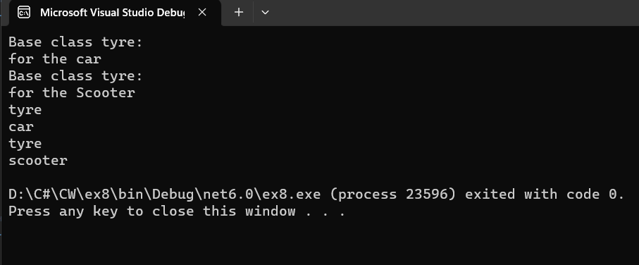

# Inheritance

## Aim:
To write a C# program to print some messages using hierarchical inheritance.

## Algorithm:
### Step 1:
Create a base class.
### Step 2:
Create two child class.
### Step 3:
Create a constructor in the base class and print a message.
### Step 4:
create a function in child class to print a message.

## Program:
```
using System;
namespace EX8
{
    public class tyre
    {
        public tyre()
        {
            Console.Write("Tyre is attached");
        }

    }
    public class car : tyre
    {
        public void display()
        {
            Console.Write(" to car\n");
        }
    }
    public class scooter : tyre
    {
        public void display()
        {
            Console.Write(" to scooter\n");
        }
    }
    public class program
    {
        public static void Main(string[] args)
        {
            car car = new car();
            car.display();
            scooter scooter = new scooter();
            scooter.display();
        }
    }
}
```
## Output:


## Result
Thus C# program to print some messages using hierarchical inheritance is written and executed sucessfully.
